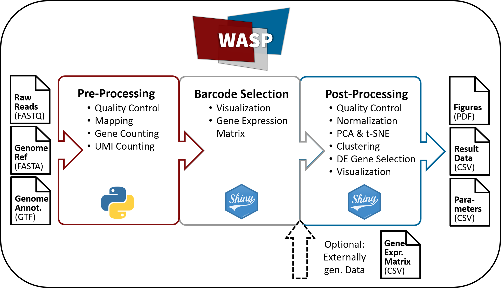

# WASP

Web-Accessible Single Cell RNA-Seq Processing Platform



## Contents
- [Description](#description)
- [Availability](#availability)
  - [Pre-Processing Pipeline](#pre-processing-pipeline)
    - [Conda](#conda)
    - [Docker](#docker)
  - [Pre-Processing Visualization](#pre-processing-visualization)
    - [Docker](#docker)
    - [Windows](#windows)
  - [Post-Processing](#post-processing)
    - [Docker](#docker)
    - [Windows](#windows)
- [Example Data Sets](#example-data-sets)


## Description
WASP is a software covering the full range of analysis steps of a typical single-cell RNA sequencing workflow for Drop-Seq-based scRNA-Seq data. 

WASP facilitates the initial processing (Pre-Processing) of raw reads generated with the ddSEQ protocol and generates demultiplexed gene expression matrices including quality metrics. The processing pipeline is realized as a Snakemake workflow, while an R Shiny application is provided for interactive result visualization. Furthermore, WASP supports the comprehensive analysis of gene expression matrices (Post-Processing), including detection of differentially expressed genes, clustering of cellular populations and interactive graphical visualization of the results. The R Shiny application can be used with gene expression matrices generated by the WASP pipeline, as well as with externally provided data from other sources. In order to perform on-premise analysis of sensitive data, WASP can easily be run using Docker, Conda or simply as a standalone version for Windows-based systems. For less experienced users WASP also provides an automated analysis mode, more experienced users can interactively change parameters during the analysis workflow. After the processing workflow, WASP provides download of publication-ready visualizations and a list of used parameters to enable reproducibility.


## Availability
The Pre-Processing and Post-Processing of WASP are separated in different modules to simplify the usage and ensure an efficient and timely analysis. The software itself is public available via Github and the project web page: [http://wasp.computational.bio](http://wasp.computational.bio). For a detailed installation and usage instruction please take a look at our [manual](https://docs.google.com/document/d/1UR6Esw56TEfjdRmJ3T4yD4EQgzoRFDvRg9c9Ji4yMa8/edit?usp=sharing).

### Pre-Processing Pipeline
WASP’s Pre-Processing pipeline is based on the workflow framework [Snakemake](https://github.com/snakemake/snakemake). To simplify WASP’s usage we provide two different installation/usage options. For the easiest usage we recommend using the Docker version as this requires no further installation. However, it is also possible to run WASP with all dependencies installed on the OS and available in the PATH. For this, we recommend using [Mamba](https://github.com/mamba-org/mamba) and [Conda](https://docs.conda.io/en/latest/) to generate an isolated environment for WASP. We further provide a YML file containing all dependencies that need to be installed.

#### Conda
For an easy installation, simply use the wasp_conda.yml file for Conda. We highly recommend using Mamba as installation tool instead of Conda, as Conda sometimes seems to have issues with finding the newest version of required dependencies. To create a new Conda environment for WASP with Mamba, please install Conda and Mamba and use the following command:

```
mamba env create -n <ENV_NAME> -f sc_pipeline.yml
```

After the environment has been set up, the following directory structure is required in order for WASP to work correctly:
```
project-dir
├── Snakefile (WASP Git)
├── Reference (User provided)
│   ├── reference.fa
│   ├── reference.gtf
├── Samples (User provided)
│   ├── Sample_1_R2.fastq
│   ├── Sample_2_R2.fastq
├── Scripts (WASP Git)
│   ├── demultiMetrics.py
│   ├── fcMetrics.py
│   ├── gene_counting_json.py
│   ├── mappingMetrics.py
│   ├── mapping_json.py
│   ├── operate_Map.py
│   ├── splitBarcodes.py
│   ├── umiMetrics.py
```

After the directory structure is set up as well and all required files are stored in the respective directories, WASP can be started. For this, please activate the generated Conda environment:

```
conda activate <ENV_NAME>
```
Alternatively, you can list all of your Conda environments with:

```
conda env list
```

and use the path to activate your previously generated WASP environment:

```
conda activate <PATH_TO_ENV>
```

To use WASP’s Pre-Processing please switch to the previously generated directory containing the Snakefile, Scripts-, Samples- and Reference directories and call the pipeline with the following command:

```
snakemake -kpj <NUMBER_OF_CPU_CORES_TO_BE_USED>
```

The pipeline will now process the ddSeq-based raw read FASTQ files and generate demultiplexed gene expression count files for each cell, a variety of intermediate results (e.g. mapping and featureCounting files) as well as quality metric JSON files and FastQC reports. 

Quality metrics files, FastQC files and demultiplexed gene expression count files can later be used with WASP’s Pre-Processing R Shiny app to visualize the quality of the Pre-Processing and to generate a gene expression matrix with a selected number of barcodes for further processing such as clustering, DE gene detection and cellular characterization. \n In general the output of the Pre-Processing will basically generate two directories:

1. Results: 
This directory contains the mentioned quality metrics files, FastQC files and demultiplexed gene expression count files as a ZIP archive. When you’ve processed multiple samples in one run, the results will be stored in subdirectories of ‘Results’ named after the sample names. For further processing the ‘Results’ directory needs to be uploaded to the Pre-Processing Shiny application.

2. Temporary: 
This directory contains intermediate results of the workflow, including the generated genome index, STAR mapping output, featureCounts output, UMI tools output and demultiplexed files. Again when using multiple samples, the results are being stored in subdirectories. This folder can be deleted if you don’t plan on using these files for any further own purposes.


#### Docker
As an alternative to the Conda installation, WASP can also simply be used as a Docker container. This container includes all necessary software dependencies as well as the Snakemake file and the Scripts. The Dockerfile can be obtained via Github, but we recommend to simply pull the container from Dockerhub:

```
docker pull andreashoek/wasp_prepro_pipe:v1.0.0
```

After the container has successfully been pulled, the analysis can easily be started. Please note that similar to the Conda workflow, the user has to provide a directory (Reference) containing:

- Genome reference FASTA file 
- Genome reference annotation GTF file

And a second directory (Samples) containing:
- Read 2 (reverse) FASTQ files from the sequenced samples

The generated output of the Pre-Processing will basically generate two directories:

1. Results:
This directory contains the mentioned quality metrics files, FastQC files and demultiplexed gene expression count files as a ZIP archive. When you’ve processed multiple samples in one run, the results will be stored in subdirectories of ‘Results’ named after the sample names. For further processing the ‘Results’ directory needs to be uploaded to the Pre-Processing Shiny application.

2. Temporary: 
This directory contains intermediate results of the workflow, including the generated genome index, STAR mapping output, featureCounts output, UMI tools output and demultiplexed files. Again when using multiple samples, the results are being stored in subdirectories. This folder can be deleted if you don’t plan on using these files for any further own purposes.

All of these mentioned directories need to be mounted into the Docker container when WASP is started. Additionally, users have to provide paths on their local system where the Results and Temporary folders should be stored.


To start the analysis & mount the required directories enter the following command:

```
docker run -d -v <LOCAL_ PATH_TO_REFERENCE_FOLDER>:/WASP/Reference \
-v <LOCAL_PATH_TO_SAMPLE_FOLDER>:/WASP/Samples \
-v <LOCAL_PATH_TO_STORE_RESULTS>:/WASP/Results \
-v <LOCAL_PATH_TO_STORE_INTERMEDIATE_RESULTS>:/WASP/Temporary \
wasp_prepro_pipe <NUMBER OF CORES>
```

Please note:
Depending on the sample size the intermediate results directory can easily grow to >100 GB, so you should provide a sufficiently large local volume during the Docker call (<LOCAL_PATH_TO_STORE_INTERMEDIA_RESULTS>).


If you do not provide a custom number of cores during the Docker run command, the container will run with 8 cores.

### Pre-Processing Visualization
The results generated during the Pre-Processing with either Conda or Docker can be uploaded into WASP’s Pre-Processing R Shiny application for:

- Quality visualization:
Using R Shiny users can assess the quality of the Pre-Processing steps (e.g. mapping, featureCounts) with interactive visualizations

- Selection of barcodes:
A major issue of Dropseq-based protocols is the separation of barcodes belonging to processed ‘real cells’ from barcodes belonging to ambient RNA captured in the device. For this, we’ve included an interactive so-called knee-plot allowing users to change the number of barcodes selected. Furthermore, a recommended cutoff is calculated.

- Generation of a gene expression matrix:
After the barcodes have been selected, the user can download a new gene expression matrix, containing the gene counts of all selected barcodes. This gene expression matrix can then be used for more detailed biological analysis steps clustering, DE gene detection and cellular characterization. This gene expression matrix is designed to be used in the WASP Post-Processing Shiny application.

The WASP Pre-Processing Shiny application can be used either as standalone version for Windows-based systems or as Docker container on any OS.

#### Docker
The R shiny application can also be used as a Docker container. First pull the container:

```
docker pull andreashoek/wasp_prepro_shiny:v1.0.0
```

Then start the container with providing a local port:

```
docker run -d -p <LOCAL_PORT>:3838 andreashoek/wasp_prepro_shiny
```

Please note: the local port is necessary to tell your web browser how to access the Shiny application start page. If you’re planning to access the Shiny app with a browser on the same system the Docker container runs you could use e.g. port 3838:

```
docker run -d -p 3838:3838 andreashoek/wasp_prepro_shiny
```

Then access the start page by starting your browser and entering:

```
127.0.0.1:3838
```

If you’re planning to access the Shiny application from outside the system your Docker container runs, e.g. when running it inside a virtual machine in a cloud environment, it might be best to provide a port such as 80 (HTTP) or 443 (HTTPS).
```
docker run -d -p 80:3838 andreashoek/wasp_prepro_shiny
docker run -d -p 443:3838 andreashoek/wasp_prepro_shiny
```
Then access the start page by starting your browser and entering the external IP address of your Docker host & upload the Result folder from the WASP pipeline.


#### Windows
The Windows standalone version of WASP’s Pre-Processing runs without any installation processes, users just need to have a recent web browser (e.g. Chrome or Firefox) installed.

Simply download & extract the ZIP archive from:

[https://s3.computational.bio.uni-giessen.de/swift/v1/WASP/Windows/WASP_PreProcessing_Shiny.zip](https://s3.computational.bio.uni-giessen.de/swift/v1/WASP/Windows/WASP_PreProcessing_Shiny.zip)

Next you can start the application by executing the WASP_Pre.bat script in the extracted folder. This will start a command line window and open a new tab in your system’s default web browser showing the start page of the Shiny application where you can upload the Result folder from the WASP pipeline.


### Post-Processing
Additional to the Pre-Processing of ddSeq-based WASP provides more detailed biological analysis steps such as:

- Quality control & filtering of the input cells 
- Normalization
- Selection of variable genes
- Dimensionality reduction 
- Clustering of cells
- Visualizations with sophisticated algorithms such as t-SNE & UMAP
- Download of high quality images and lists of gene expression as well as used parameters

As these analyses all begin with a gene expression matrix, it is also possible to use this part of WASP with data derived from other protocols.
The Post-Processing offers an automatic mode designed for less experienced users and a manual mode for more experienced users, allowing to change parameters between steps. In both cases, all results are presented in the end as an interactive web page with download options. 

The Post-Processing is fully implemented as an R Shiny application with a similar usage to the Pre-Processing Shiny module. WASP’s Post-Processing is available as Windows standalone version and as Docker container for any OS.

#### Docker
The R shiny application can also be used as a Docker container. First pull the container:

```
docker pull andreashoek/wasp_postpro_shiny:v1.0.0
```

Then start the container with providing a local port:

```
docker run -d -p <LOCAL_PORT>:3838 andreashoek/wasp_postpro_shiny
```

Please note: the local port is necessary to tell your web browser how to access the Shiny application start page. If you’re planning to access the Shiny app with a browser on the same system the Docker container runs you could use e.g. port 3838:

```
docker run -d -p 3838:3838 andreashoek/wasp_postpro_shiny
```

Then access the start page by starting your browser and entering:

```
127.0.0.1:3838
```

If you’re planning to access the Shiny application from outside the system your Docker container runs, e.g. when running it inside a virtual machine in a cloud environment, it might be best to provide a port such as 80 (HTTP) or 443 (HTTPS).

```
docker run -d -p 80:3838 andreashoek/wasp_postpro_shiny
docker run -d -p 443:3838 andreashoek/wasp_postpro_shiny
```

Then access the start page by starting your browser and entering the external IP address of your Docker host & upload the Result folder from the WASP pipeline.


#### Windows
The Windows standalone version of WASP’s Post-Processing runs without any installation processes, users just need to have a recent web browser (e.g. Chrome or Firefox) installed.

Simply download & extract the ZIP archive from:

[https://s3.computational.bio.uni-giessen.de/swift/v1/WASP/Windows/WASP_PostProcessing_Shiny.zip](https://s3.computational.bio.uni-giessen.de/swift/v1/WASP/Windows/WASP_PostProcessing_Shiny.zip)

Next you can start the application by executing the WASP_Post.bat script in the extracted folder. This will start a command line window and open a new tab in your system’s default web browser showing the start page of the Shiny application where you can upload the Result folder from the WASP pipeline.

## Example Data Sets
For each of WASP's three modules, you can download example data sets to test the software:

**Pre-Processing Pipeline**
[https://s3.computational.bio.uni-giessen.de/swift/v1/WASP/Example_Data/WASP_PreProcessing_Snakemake_Example.tar.gz](https://s3.computational.bio.uni-giessen.de/swift/v1/WASP/Example_Data/WASP_PreProcessing_Snakemake_Example.tar.gz)

**Pre-Processing Visualization**
[https://s3.computational.bio.uni-giessen.de/swift/v1/WASP/Example_Data/WASP_PreProcessing_Shiny_Example.zip](https://s3.computational.bio.uni-giessen.de/swift/v1/WASP/Example_Data/WASP_PreProcessing_Shiny_Example.zip)

**Post-Processing**
[https://s3.computational.bio.uni-giessen.de/swift/v1/WASP/Example_Data/WASP_PostProcessing_Shiny_Example.zip](https://s3.computational.bio.uni-giessen.de/swift/v1/WASP/Example_Data/WASP_PostProcessing_Shiny_Example.zip)
